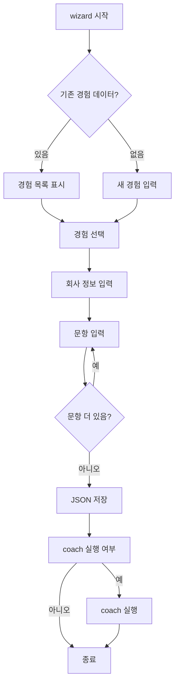

# 대화형 Wizard 및 경험 가져오기 기능 계획

## 개요

Resume Agent에 대화형 CLI Wizard를 추가하고, `취업/경험정리/` 폴더의 기존 경험 데이터를 자동으로 가져오는 기능을 구현합니다.

---

## 1. Wizard CLI 명령어

### 1.1 새 명령어: `resume-agent wizard`

```bash
resume-agent wizard my_run
```

대화형으로 다음 정보를 입력받습니다:
- 회사명
- 직무명
- 기업 유형 (공공/대기업/중견/스타트업)
- 자소서 문항 (1개씩 순차 입력)
- 경험 선택 (기존 경험에서 선택 또는 새로 입력)

### 1.2 워크플로우



---

## 2. 경험 파일 파서

### 2.1 지원 포맷

| 포맷 | 파일 | 파서 |
|------|------|------|
| DOCX | 경험요약정리.docx | python-docx |
| TXT | 인생기술서 등 | 기본 텍스트 파싱 |
| JSON | 사용자 정의 | json |

### 2.2 경험 데이터 추출 패턴

`경험요약정리.docx`의 구조를 분석하면 다음 패턴이 있습니다:

```
번호. 제목: 한 줄 요약

상황(Situation): ...
과제(Task): ...
행동(Action): ...
결과(Result): ...
```

이 패턴을 정규식으로 파싱하여 [`Experience`](../src/resume_agent/models.py:63) 모델로 변환합니다.

### 2.3 추출 필드 매핑

| 원본 필드 | Experience 모델 필드 |
|-----------|---------------------|
| 제목 | title |
| 상황 | situation |
| 과제 | task |
| 행동 | action |
| 결과 | result |
| 수치/증거 | metrics, evidence_text |
| 태그 | tags |

---

## 3. 구현 계획

### 3.1 새 파일: `src/resume_agent/wizard.py`

```python
from pathlib import Path
from typing import List, Optional
from rich.console import Console
from rich.prompt import Prompt, Confirm
from rich.table import Table

from .models import Experience, ApplicationProject, Question
from .state import save_experiences, save_project

console = Console()

def run_wizard(workspace_path: Path) -> dict:
    """대화형 위자드 실행"""
    # 1. 기존 경험 데이터 확인
    # 2. 회사 정보 입력
    # 3. 문항 입력
    # 4. 경험 선택/입력
    # 5. 저장
    pass

def import_experiences_from_file(file_path: Path) -> List[Experience]:
    """파일에서 경험 데이터 가져오기"""
    pass

def parse_experience_docx(file_path: Path) -> List[Experience]:
    """DOCX 파일에서 STAR 구조 파싱"""
    pass
```

### 3.2 CLI 명령어 추가: `src/resume_agent/cli.py`

```python
p_wizard = sub.add_parser("wizard", help="Interactive wizard for setup.")
p_wizard.add_argument("workspace")
p_wizard.add_argument("--import-experiences", help="Path to experience file.")
p_wizard.set_defaults(func=cmd_wizard)
```

### 3.3 의존성 추가: `pyproject.toml`

```toml
dependencies = [
    "pydantic>=2.0",
    "rich",
    "python-docx",  # 추가
]
```

---

## 4. 사용 예시

### 4.1 기본 사용

```bash
# 위자드 시작
resume-agent wizard my_run

# 경험 파일에서 가져오기
resume-agent wizard my_run --import-experiences 취업/경험정리/경험요약정리.docx
```

### 4.2 대화 예시

```
🎯 Resume Agent Wizard

📁 기존 경험 데이터를 가져오시겠습니까? [y/N]: y
📄 경험 파일 경로: 취업/경험정리/경험요약정리.docx
✅ 13개 경험을 가져왔습니다.

🏢 회사명을 입력하세요: 국민건강보험공단
💼 직무명을 입력하세요: 행정직 6급
🏢 기업 유형을 선택하세요 [공공/대기업/중견/스타트업]: 공공

📝 자소서 문항 입력 (빈 줄로 종료)

문항 1: 지원동기와 해당 직무에 적합한 이유를 작성해 주세요.
글자수 제한 (없으면 Enter): 500

문항 2: 협업 과정에서 갈등을 해결한 경험을 작성해 주세요.
글자수 제한 (었으면 Enter): 500

문항 3: (빈 줄 입력)

📊 문항별 경험 배분

Q1 (지원동기) - 추천 경험:
  1. 국민연금공단 인턴: 방대한 데이터 처리
  2. 서울시청 코로나19 지원팀: 위기 대처
  3. 직접 선택
  
선택 [1-3]: 1

... (계속)

✅ 저장 완료!
  - my_run/state/project.json
  - my_run/state/experiences.json

🚀 coach를 실행하시겠습니까? [Y/n]: y
```

---

## 5. 구현 순서

1. **wizard.py 기본 구조** - Rich 기반 대화형 UI
2. **DOCX 파서** - 경험요약정리.docx 파싱
3. **CLI 통합** - wizard 명령어 추가
4. **경험 배분 추천** - domain.py의 `allocate_experiences` 활용
5. **테스트** - 실제 데이터로 테스트

---

## 6. 향후 확장

- [ ] PDF 파서 추가
- [ ] 웹 기반 Wizard (Streamlit)
- [ ] 경험 데이터 버전 관리
- [ ] 이전 자소서에서 경험 추출
